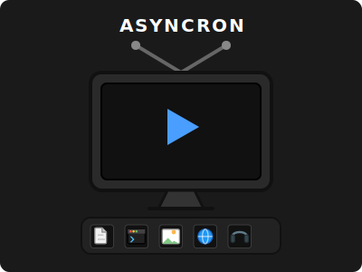

# Asyncron 📺

**Asyncron** es una extensión de Chrome diseñada para equipos remotos, flexibles y con horarios rotativos que necesitan una comunicación asíncrona de alta fidelidad. Permite grabar mensajes de video (pantalla/cámara) y empaquetarlos junto con archivos críticos (código, documentos, imágenes, enlaces) en un único archivo comprimido `.async`.

## 🌐 ¿Por qué Asyncron? La Utilidad para Equipos Remotos

En entornos con **horarios flexibles y turnos rotativos**, la comunicación en tiempo real es a menudo imposible o ineficiente. Las explicaciones por texto pierden el matiz, y los videos sueltos pierden el contexto. 

Asyncron resuelve esto permitiendo:
*   **Preservación del Contexto:** No envíes solo un video; envía el video *junto* al código exacto que estabas revisando, el PDF de requisitos y los enlaces de referencia. Todo en un solo paquete.
*   **Reducción de la Fatiga de Notificaciones:** En lugar de 5 archivos adjuntos y un link de video en un chat, el receptor recibe un único contenedor organizado.
*   **Consumo a Demanda:** El compañero que entra en el turno de noche puede abrir el bundle y tener todas las herramientas listas para trabajar sin necesidad de preguntarte nada.

---

## 🛠️ Manual de Instalación (Modo Desarrollador)

Dado que Asyncron es una herramienta potente y personalizada, puedes instalarla directamente en tu navegador sin pasar por la tienda oficial:

1.  **Descarga el código:** Clona este repositorio o descarga el archivo ZIP y descomprímelo en una carpeta local.
2.  **Abre las Extensiones de Chrome:** En la barra de direcciones de Chrome, escribe `chrome://extensions/` y pulsa Enter.
3.  **Activa el "Modo de desarrollador":** En la esquina superior derecha, activa el interruptor que dice **Developer mode**.
4.  **Carga la extensión:** Haz clic en el botón **Load unpacked** (Cargar descomprimida) que aparecerá a la izquierda.
5.  **Selecciona la carpeta:** Navega hasta la carpeta donde descomprimiste Asyncron y selecciona la carpeta raíz (donde está el archivo `manifest.json`).
6.  **¡Listo!:** El icono de Asyncron aparecerá en tu barra de herramientas.

---

## 📖 Manual de Instrucciones Detallado

### 1. Crear un Bundle (Pestaña CREATE)
*   **Selecciona la fuente:** Elige entre **Screen** (Pantalla), **Camera** (Cámara) o **Both** (Ambos - Modo PiP).
*   **Graba:** Haz clic en **REC**. Si elegiste pantalla, selecciona la ventana o pestaña que deseas capturar.
*   **Añade Contexto:**
    *   **+ Add Files:** Sube cualquier archivo. La extensión lo categorizará automáticamente.
    *   **+ Add Link:** Pega una URL. Se guardará como un acceso directo interactivo.
*   **Finaliza:** Haz clic en **STOP** y luego en **CREATE BUNDLE**. Se descargará un archivo `.async`.

### 2. Ver un Bundle (Pestaña VIEWER)
*   **Auto-Detección:** Si descargas un archivo `.async`, la extensión te ofrecerá abrirlo automáticamente.
*   **Carga Manual:** Ve a la pestaña **VIEWER** y arrastra el archivo `.async` al área central.
*   **Interactúa:** 
    *   Haz clic en la **TV** para descargar el video de la grabación.
    *   Haz clic en los **Iconos de la Botonera** para extraer los archivos adjuntos.
    *   Si es un **Link**, ¡se abrirá directamente en una nueva pestaña!

---

## 📂 Formatos y Categorías Soportadas

Asyncron es inteligente. Detecta automáticamente la naturaleza de tus archivos:

*   💻 **Código:** Soporta más de 50 extensiones (`.js`, `.py`, `.cpp`, `.rs`, `.php`, `.yml`, `.dockerfile`, etc.). Se representan con el icono de terminal.
*   📄 **Documentos:** PDFs, Word, Excel, Markdown, TXT. Icono de hoja de papel.
*   🖼️ **Imágenes:** PNG, JPG, SVG, WebP. Icono de galería.
*   🔗 **Enlaces:** Cualquier URL guardada. Icono de mundo interactivo.
*   🔊 **Audio:** MP3, WAV, OGG. Icono de auriculares.

---

**Asyncron v0.1.0** - Desarrollado para la eficiencia asíncrona.
