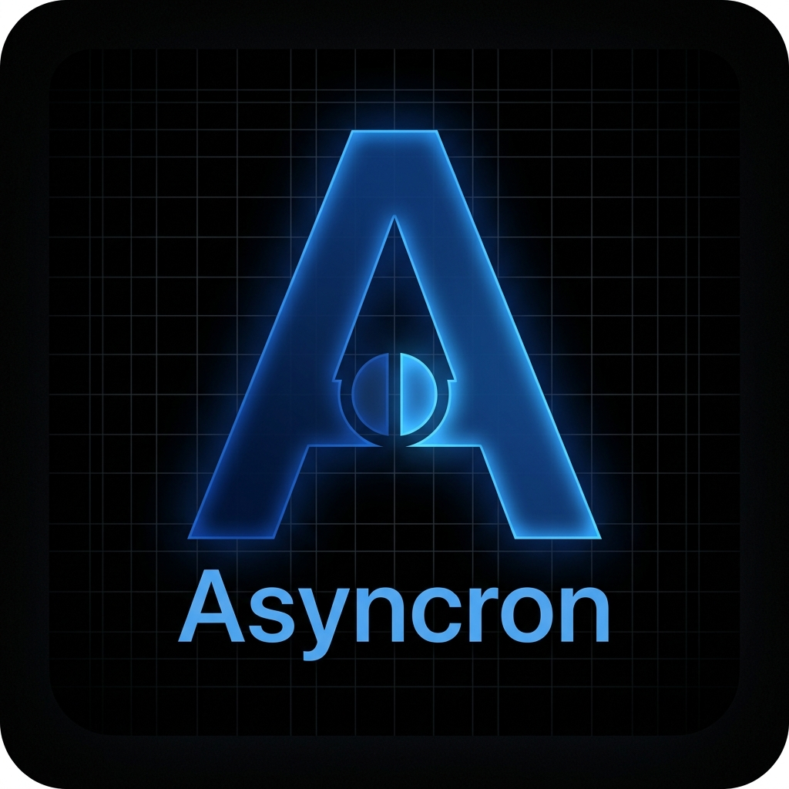
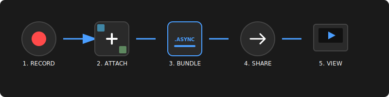

# Asyncron 📺

**Asyncron** is a high-fidelity asynchronous communication tool designed for remote teams with flexible schedules and rotating shifts. It enables you to record video messages (screen/camera) and package them alongside critical files (code, documents, images, and links) into a single, cohesive `.async` bundle.

## 📁 Repository Structure

- `asyncron-chrome/`: Chrome Extension (Manifest V3)
- `asyncron-firefox/`: Firefox Extension (Manifest V2)

Both versions share the same core logic and UI, but are optimized for their respective browser requirements.

---

## 🌐 Why Asyncron? High-Fidelity Remote Collaboration

In environments with **flexible hours and time-zone gaps**, real-time meetings are often a bottleneck. Pure text lacks nuance, and scattered attachments lose their context.

Asyncron bridges this gap by providing:
*   **Context Preservation:** Don't just send a video; send the video *anchored* to the exact code files, requirement PDFs, and reference links needed to act.
*   **Zero-Overhead Organization:** Instead of 5 disjointed attachments in a chat thread, the recipient receives a single, organized container.
*   **On-Demand Consumption:** A teammate starting their shift hours later has everything they need in one place, reducing the need for "where is that file?" follow-up questions.

---

## 🔄 Complete Workflow Example

Imagine you are a Lead Developer working in Europe, and your QA Engineer is in Australia.

1.  **RECORD:** You open Asyncron and record a 2-minute walkthrough of a new feature implementation using the **Screen + Camera** mode.
2.  **ATTACH:** You add the relevant `.js` and `.css` files, a screenshot of the expected UI, and a link to the Pull Request.
3.  **BUNDLE:** You click **CREATE BUNDLE**. Asyncron generates `feature_v1.async`.
4.  **SHARE:** You drop the `.async` file into your team's Slack or WhatsApp. You go to sleep.
5.  **VIEW:** Your QA Engineer wakes up, downloads the file, and Asyncron's viewer opens automatically. They watch your explanation while having direct access to the code and links to start testing immediately.

---

## 🛠️ Installation Guide (Developer Mode)

### Chrome Installation
1.  Navigate to `chrome://extensions/` in your browser.
2.  Enable **"Developer mode"** (top right toggle).
3.  Click **"Load unpacked"**.
4.  Select the `asyncron-chrome/` folder in this repository.
5.  The extension appears in your toolbar.

### Firefox Installation
1.  Navigate to `about:debugging` in Firefox.
2.  Click **"This Firefox"** in the sidebar.
3.  Click **"Load Temporary Add-on..."**.
4.  Navigate to the `asyncron-firefox/` folder and select `manifest.json`.
5.  The extension appears in your toolbar.
*Note: Temporary add-ons are removed when Firefox restarts. For permanent installation, use Firefox Developer Edition.*

---

## 📖 Detailed User Manual

### 1. Creating a Bundle (CREATE Tab)
*   **Select Source:** Choose **Screen**, **Camera**, or **Both** (Picture-in-Picture mode).
*   **Start Recording:** Click **REC**. Select the window or tab to capture if prompted.
*   **Add Context:**
    *   **+ Add Files:** Upload any file. The extension automatically categorizes it.
    *   **+ Add Link:** Paste a URL to create an interactive shortcut inside the bundle.
*   **Finalize:** Click **STOP**, then click **CREATE BUNDLE**.

### 2. Viewing a Bundle (VIEWER Tab)
*   **Auto-Detection:** When you download an `.async` file, the extension will prompt you to open it.
*   **Manual Load:** Go to the **VIEWER** tab and drag & drop any `.async` file.
*   **Interaction:** 
    *   Click the **TV Screen** to download the main recording.
    *   Click the **Control Panel Icons** to extract attachments.
    *   **Links** will open directly in a new browser tab when clicked!

### 🛡️ Bundle Recovery (Lost your file?)

Sometimes you might lose track of where a teammate's bundle was saved. Asyncron includes a **Recovery Feature** in the Viewer tab:
1.  **Scan:** It automatically lists the 5 most recent `.async` files found in your browser's download history.
2.  **Locate:** Click the **LOCATE** button next to any file to open the folder and highlight it.
3.  **Drag & View:** Drag that file into the Asyncron drop zone to start viewing.

---

## 📦 Bundle Format (.async)

The `.async` bundle is a standard uncompressed `tar` archive containing:
- `manifest.json`: Metadata about the recording and attachments.
- `video/ recording.webm`: The main screen/camera capture.
- `codes/`, `documents/`, `images/`, `links/`, `audio/`: Subfolders containing the attachments.

---

**Asyncron v0.1.0** - Built for asynchronous efficiency.
